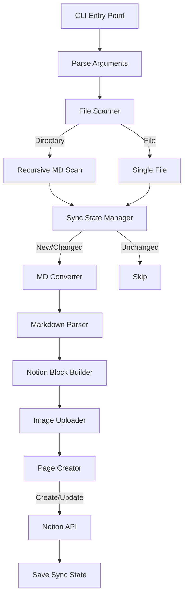

# MD to Notion CLI Implementation

## Architecture Overview




## Key Files to Create

- `src/cli.ts` - CLI entry point with argument parsing
- `src/scanner.ts` - File system scanner for md files
- `src/sync-state.ts` - Sync state manager for idempotency
- `src/parser/index.ts` - Markdown parser orchestrator
- `src/parser/frontmatter.ts` - YAML frontmatter extraction
- `src/parser/blocks.ts` - Block-level parsing (headings, lists, code, etc.)
- `src/parser/inline.ts` - Inline formatting (bold, italic, links, math)
- `src/notion/blocks.ts` - Convert parsed AST to Notion block format
- `src/notion/client.ts` - Notion API wrapper with batching
- `src/notion/upload.ts` - Image file upload handler

## Critical Implementation Details

### 1. Markdown Parsing Strategy

Use regex-based parsing as shown in [examples.md](/.cursor/skills/md-to-notion/examples.md). Full pattern reference:

**Block-level patterns:**

- **Frontmatter**: `/^---\n([\s\S]*?)\n---\n/`
- **Headings**: `/^(#{1,3})\s+(.+)$/m`
- **Code blocks**: `/^```(\w*)\n([\s\S]*?)\n```$/m`
- **Block math**: `/^\$\$\n?([\s\S]*?)\n?\$\$$/m` (including `\begin{aligned}`, `\begin{cases}`)
- **Callouts**: `/^>\s*\[!(\w+)\]\s*(.*)?$/` (with extended type mapping)
- **Plain blockquotes**: `/^>\s+(.+)$/m` (when not a callout)
- **Tables**: Pipe-delimited rows with header separator
- **Bulleted lists**: `/^[-*]\s+(.+)$/m` (with nesting via indentation)
- **Numbered lists**: `/^\d+\.\s+(.+)$/m`
- **Task lists**: `/^-\s+\[([ xX])\]\s+(.+)$/m`
- **Dividers**: `/^---$/m` or `/^\*\*\*$/m`
- **Images**: `/!\[([^\]]*)\]\(([^)]+)\)/g` and `!/\[\[([^\]]+)\]\]/g`

**Inline patterns:**

- **Bold**: `/\*\*([^*]+)\*\*/`
- **Italic**: `/\*([^*]+)\*/` or `/_([^_]+)_/`
- **Inline code**: `/`([^`]+)`/`
- **Strikethrough**: `/~~([^~]+)~~/`
- **Highlights**: `/==([^=]+)==/` → yellow_background
- **Inline math**: `/\$([^$]+)\$/`
- **Links**: `/\[([^\]]+)\]\(([^)]+)\)/`
- **Wiki-links**: `/\[\[([^\]|]+)(?:\|([^\]]+))?\]\]/`
- **Footnote refs**: `/\[\^(\w+)\]/`

**Special handling:**

- **Relative MD links**: URL-decode paths, resolve relative to source file
- **Footnotes**: Collect definitions, convert refs to superscripts, append at end
- **YouTube links**: Option to convert to bookmark/embed blocks
- **Local images**: Resolve path relative to MD file, upload via SDK

### 2. Directory Structure Mirroring

When importing a directory, create nested pages in Notion:

```
./doc/
  ├── A/
  │   ├── file1.md
  │   └── file2.md
  └── B/
      └── file3.md
```

Becomes in Notion (under destination page):

- **doc** (page)
  - **A** (page)
    - **file1** (page with content)
    - **file2** (page with content)
  - **B** (page)
    - **file3** (page with content)

### 3. Image Upload Flow

Use `@notionhq/client` SDK's `fileUploads` API (no raw HTTP requests):

```typescript
import { Client } from "@notionhq/client";

const notion = new Client({ auth: process.env.NOTION_API_KEY }); // Bun auto-loads .env
const TWENTY_MB = 20 * 1024 * 1024;
const TEN_MB = 10 * 1024 * 1024;

async function uploadFile(filePath: string): Promise<string> {
  const file = Bun.file(filePath);
  const fileBuffer = Buffer.from(await file.arrayBuffer());
  const filename = path.basename(filePath);
  const contentType = file.type;
  const fileSize = file.size;

  if (fileSize <= TWENTY_MB) {
    return uploadSmallFile(fileBuffer, filename, contentType);
  } else {
    return uploadLargeFile(fileBuffer, filename, contentType);
  }
}

// Small files (≤20 MB): single-part upload
async function uploadSmallFile(data: Buffer, filename: string, contentType: string): Promise<string> {
  const upload = await notion.fileUploads.create({
    mode: "single_part",
    filename,
    content_type: contentType,
  });
  await notion.fileUploads.send({
    file_upload_id: upload.id,
    file: { filename, data },
  });
  return upload.id;
}

// Large files (>20 MB): multi-part upload (requires paid workspace)
async function uploadLargeFile(data: Buffer, filename: string, contentType: string): Promise<string> {
  const parts = splitIntoChunks(data, TEN_MB); // 10 MB chunks

  // 1. Create multi-part upload
  const upload = await notion.fileUploads.create({
    mode: "multi_part",
    number_of_parts: parts.length,
    filename,
    content_type: contentType,
  });

  // 2. Send all parts (can be parallelized)
  await Promise.all(parts.map((chunk, i) =>
    notion.fileUploads.send({
      file_upload_id: upload.id,
      part_number: i + 1,
      file: { filename, data: chunk },
    })
  ));

  // 3. Complete the upload
  await notion.fileUploads.complete({ file_upload_id: upload.id });

  return upload.id;
}

function splitIntoChunks(buffer: Buffer, chunkSize: number): Buffer[] {
  const chunks: Buffer[] = [];
  for (let i = 0; i < buffer.length; i += chunkSize) {
    chunks.push(buffer.subarray(i, i + chunkSize));
  }
  return chunks;
}
```

**Note**: Multi-part uploads (files > 20 MB) require a **paid Notion workspace**. Max file size is 5 GB.

### 4. Notion API Batching

Notion limits to 100 blocks per request. Implement batching in `src/notion/client.ts`:

```typescript
async function createPageWithBlocks(parentId: string, title: string, blocks: Block[]) {
  const page = await notion.pages.create({
    parent: { page_id: parentId },
    properties: { title: [{ text: { content: title } }] },
    children: blocks.slice(0, 100),
  });
  for (let i = 100; i < blocks.length; i += 100) {
    await notion.blocks.children.append({
      block_id: page.id,
      children: blocks.slice(i, i + 100),
    });
  }
  return page;
}
```

### 5. Internal Link Handling

For wiki-links `[[Page Name]]` and relative links `[text](./other.md)`:

- Convert to **styled text** (blue color, bold) - no actual cross-linking
- Example: `[[Neural Networks]]` → bold blue text "Neural Networks"

### 6. Page Title Source

- Use **filename** without `.md` extension
- Example: `Introduction to AI.md` → page titled "Introduction to AI"

### 7. Frontmatter Handling

- **Ignore** frontmatter metadata (tags, created, updated dates)
- Only parse frontmatter to strip it from content

### 8. YouTube Links

- Render as **regular text links** (not bookmark/embed blocks)

### 9. CLI Flags

- `--force`: Re-import all files, ignoring sync state
- `--dry-run`: Preview what would be imported without making changes
- `--verbose`: Show detailed progress (file count, current file, etc.)

### Edge Cases

- **.canvas files**: Skip entirely (Obsidian-specific, not markdown)
- **Missing images**: Insert placeholder text block noting the missing image path
- **Empty directories**: Skip (don't create empty pages in Notion)

### 10. Idempotency (Re-run Safety)

Store sync state in `.notion-sync.json` at the source directory root:

```typescript
interface SyncState {
  destinationPageId: string;
  files: Record<string, {
    notionPageId: string;
    contentHash: string;      // MD5/SHA256 of file content
    lastSynced: string;       // ISO timestamp
  }>;
  directories: Record<string, {
    notionPageId: string;
  }>;
}
```

**Sync Logic:**

1. **Load state** - Read `.notion-sync.json` if exists
2. **For each file/directory:**
  - If not in state: **Create** new Notion page
  - If in state but content hash changed: **Update** existing page (delete old blocks, append new)
  - If in state and unchanged: **Skip**
  - **Save state immediately** after each successful file/directory sync
3. **On failure**: Re-run the same command to resume from failure point

**Failure Recovery:**

The incremental save strategy ensures:

- Progress is never lost on failure
- Re-running the command resumes exactly where it left off
- Already-synced files are skipped (not re-uploaded)
- Partially created pages (if page created but blocks failed) will be detected and updated on retry

**Update Strategy:**

To update an existing page (using SDK methods):

1. Get existing blocks: `notion.blocks.children.list({ block_id: pageId })`
2. Delete each block: `notion.blocks.delete({ block_id })` for each
3. Append new blocks: `notion.blocks.children.append({ block_id: pageId, children })`
4. Update content hash in state

**Benefits:**

- Running `md-to-notion ./doc 12345` multiple times won't create duplicates
- Only changed files are re-synced (faster subsequent runs)
- State file can be committed to git or gitignored based on preference

## Runtime & Dependencies

**Runtime**: Bun (not Node.js)

- Use `bun run` to execute, `bun install` to install
- Use `Bun.file()` for file I/O instead of `node:fs`
- Bun auto-loads `.env` - no dotenv needed
- Use `bun:test` for testing

**Already in package.json:**

- `@notionhq/client` - Notion SDK

**To add via `bun add`:**

- `js-yaml` - YAML frontmatter parsing

**CLI setup in package.json:**

```json
{
  "bin": {
    "md-to-notion": "./src/cli.ts"
  },
  "scripts": {
    "start": "bun run src/cli.ts"
  }
}
```

## Environment

- `NOTION_API_KEY` - Required (create at [https://www.notion.so/my-integrations](https://www.notion.so/my-integrations))
- Bun automatically loads from `.env` file
